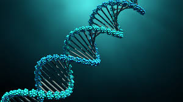

<!DOCTYPE HTML>
<!--
	Highlights by HTML5 UP
	html5up.net | @ajlkn
	Free for personal and commercial use under the CCA 3.0 license (html5up.net/license)
-->
<html>
	<head>
		<title>Anas A S</title>
		<meta charset="utf-8" />
		<meta name="viewport" content="width=device-width, initial-scale=1, user-scalable=no" />
		<link rel="stylesheet" href="main.css" />
	</head>
	<body class="is-preload">

		<!-- Header -->
			<section id="header">
				<header class="major">
					<h1>Anas A S</h1>
					
Computational Biologist Specialization in NGS Data Analytics

				</header>
				

					<ul class="actions special">
						<li><a href="#one" class="button primary scrolly">Begin</a></li>
					</ul>
				

			</section>

		<!-- One -->
			<section id="one" class="main special">
                                     

					

						<header class="major">
							<h2>Who I am</h2>
						</header>
						
 As a computational biologist specializing in NGS data analytics, I am passionate about leveraging my expertise to drive genomics research forward. I possess a solid foundation in biology and computer science, allowing me to make significant contributions in understanding the intricacies of the genome and its impact on human health and disease.

					

					<a href="#two" class="goto-next scrolly">Next</a>
				

			</section>

		<!-- Two -->
			<section id="two" class="main special">
				

					
					

						<header class="major">
							<h2>I am interested in</h2>
						</header>
						
In my role, I like to  work with various types of NGS data, such as DNA sequencing, RNA sequencing, ChIP sequencing, and also it utilize computational tools

							<li>
							  
							</li>
       
						</ul>
					

					<a href="#three" class="goto-next scrolly">Next</a>
				

			</section>

		<!-- Three -->
			<section id="three" class="main special">
                         	      

					

						<header class="major">
							<h2>Next Generation Sequencing</h2>
						</header>
						
NGS is a transformative technology that has revolutionized genomics research by enabling the rapid and cost-effective sequencing of DNA. It has broad applications across various domains, and computational biologists specializing in NGS data analytics play a crucial role in extracting meaningful biological insights from the vast amount of sequencing data generated.

					

					<a href="#footer" class="goto-next scrolly">Next</a>
				

    <!-- Footer -->
			<section id="footer">
				

					<header class="major">
						<h2>Get in touch</h2>
					</header>
			</section>
				<footer>
					<ul class="icons">
						<li><a href="tel:+919947957876" class="fa-brands-400.eot">Mobile</a></li>
										<li><a href=mailto:"anasgpk7@gmail.com" class="fa-brands-400.svg">Gmail</a></li>
										<li><a href="https://www.linkedin.com/in/anas-a-s-380938258" class="fa-brands-400.ttf">Linkedin</a></li>
										<li><a href="https://github.com/AnasAnsari123" class="fa-brands-400.woff">Github</a></li>
					</ul>
               			 

					<ul class="copyright">
						<li>&copy; Untitled</li><li>Design: <a href="http://html5up.net">HTML5 UP</a></li><li>Demo Images: <a href="http://unsplash.com">Unsplash</a></li>
					</ul>
				</footer>
			</section>

		<!-- Scripts -->
			
			
			
			
			
			
			

	</body>
</html>
